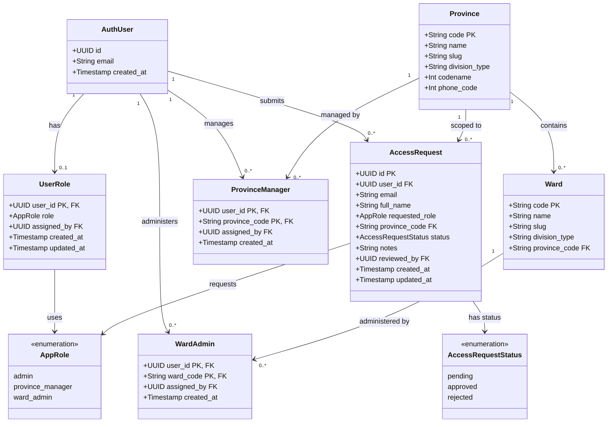

# Class Diagram – RBAC & Quản lý người dùng

Vẽ class diagram cho module phân quyền (RBAC) và quản lý người dùng theo tỉnh/xã.

## Mermaid

## Mô tả

| Bảng | Vai trò |
|---|---|
| `auth.users` | Người dùng hệ thống (Supabase Auth) |
| `user_roles` | Gán vai trò toàn cục cho người dùng |
| `province_managers` | Ánh xạ người dùng quản lý tỉnh |
| `ward_admins` | Ánh xạ người dùng quản lý xã/phường |
| `access_requests` | Yêu cầu cấp quyền từ người dùng |
| `provinces` | Danh sách tỉnh/thành phố |
| `wards` | Danh sách xã/phường/thị trấn |
