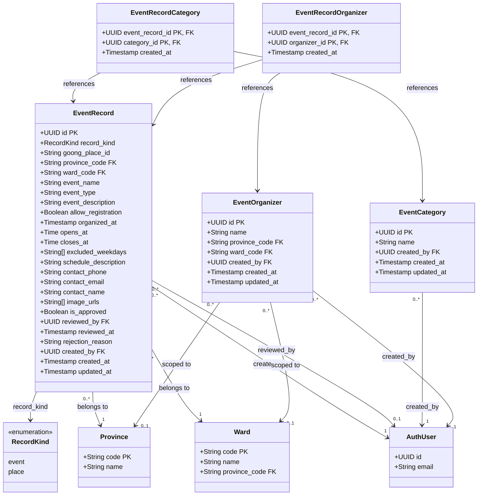

# Class Diagram – Sự kiện & Địa điểm

Vẽ class diagram cho module quản lý sự kiện và địa điểm du lịch, bao gồm phân loại, ban tổ chức và quy trình duyệt.

## Mermaid

## Mô tả

| Bảng | Vai trò |
|---|---|
| `event_records` | Bản ghi sự kiện hoặc địa điểm (record_kind = event/place) |
| `event_categories` | Danh mục phân loại sự kiện |
| `event_organizers` | Đơn vị tổ chức sự kiện, phân phạm vi tỉnh/xã |
| `event_record_categories` | Bảng liên kết nhiều-nhiều: sự kiện ↔ danh mục |
| `event_record_organizers` | Bảng liên kết nhiều-nhiều: sự kiện ↔ ban tổ chức |
