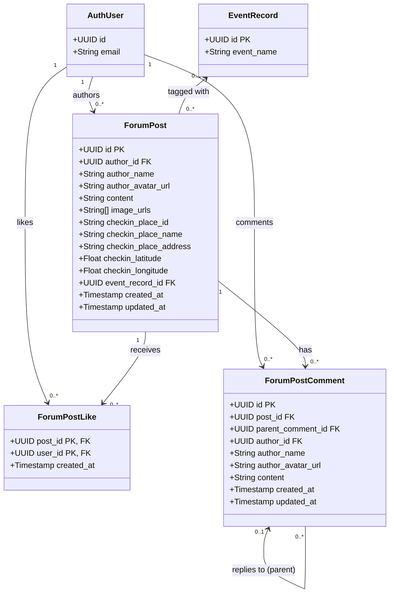

# Class Diagram – Forum & Tương tác xã hội

Vẽ class diagram cho module diễn đàn cộng đồng: bài viết, lượt thích, bình luận và trả lời.

## Mermaid

## Mô tả

| Bảng | Vai trò |
|---|---|
| `forum_posts` | Bài viết của người dùng, có thể đính kèm ảnh hoặc check-in địa điểm |
| `forum_post_likes` | Lượt thích bài viết (quan hệ nhiều-nhiều user ↔ post) |
| `forum_post_comments` | Bình luận bài viết, hỗ trợ trả lời lồng nhau (parent_comment_id) |

### Ràng buộc nghiệp vụ
- Bài viết phải có ít nhất nội dung text hoặc một ảnh.
- Check-in yêu cầu latitude/longitude đi kèm tên địa điểm.
- Bình luận trả lời (`parent_comment_id`) phải cùng bài viết với bình luận cha.
