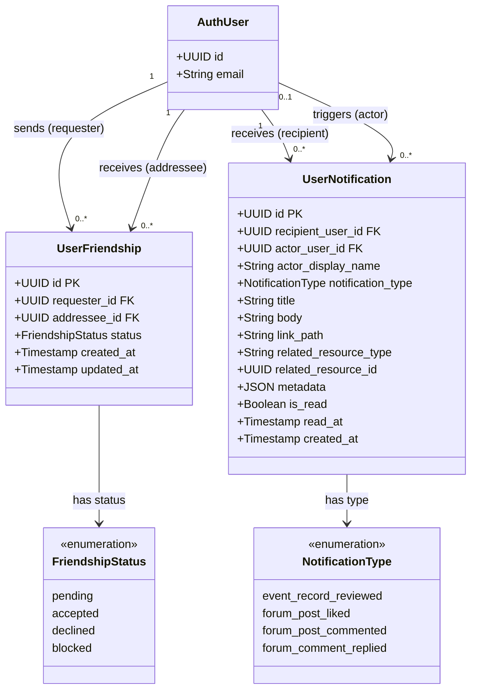

# Class Diagram – Kết bạn & Thông báo người dùng

Vẽ class diagram cho module kết bạn và hệ thống thông báo trong ứng dụng.

## Mermaid

## Mô tả

| Bảng | Vai trò |
|---|---|
| `user_friendships` | Quan hệ kết bạn giữa hai người dùng; mỗi cặp chỉ có tối đa một bản ghi |
| `user_notifications` | Thông báo gửi đến người dùng về các sự kiện trong ứng dụng |

### Ràng buộc nghiệp vụ
- `user_friendships`: không thể tự kết bạn với chính mình; unique index trên cặp (least, greatest) đảm bảo không trùng lặp theo chiều.
- `user_notifications`: `is_read = true` khi và chỉ khi `read_at` không null.
- Thông báo hỗ trợ 4 loại: duyệt sự kiện, thích bài viết, bình luận bài viết, trả lời bình luận.
