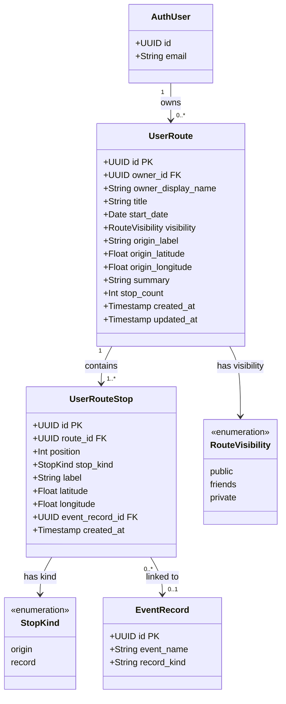

# Class Diagram – Tuyến đường cá nhân

Vẽ class diagram cho module lập và chia sẻ tuyến đường du lịch cá nhân.

## Mermaid

## Mô tả

| Bảng | Vai trò |
|---|---|
| `user_routes` | Tuyến đường du lịch do người dùng tạo, có thể chia sẻ public/friends/private |
| `user_route_stops` | Các điểm dừng trong tuyến đường, theo thứ tự position |

### Ràng buộc nghiệp vụ
- `stop_count` được đồng bộ tự động qua trigger; luôn ≥ 0.
- `(route_id, position)` là unique — không có hai điểm dừng cùng vị trí trong một tuyến.
- Visibility `friends` được kiểm tra qua RLS sử dụng hàm `is_user_friend()`.
- `stop_kind = 'origin'` là điểm xuất phát; `'record'` là điểm dừng gắn với sự kiện/địa điểm.
