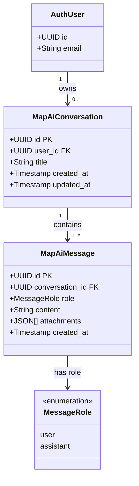

# Class Diagram – AI Chat trên bản đồ

Vẽ class diagram cho module trò chuyện AI tích hợp vào bản đồ du lịch.

## Mermaid

## Mô tả

| Bảng | Vai trò |
|---|---|
| `map_ai_conversations` | Cuộc hội thoại AI của từng người dùng trên bản đồ |
| `map_ai_messages` | Tin nhắn trong cuộc hội thoại (user hoặc assistant) |

### Ràng buộc nghiệp vụ
- `title` của cuộc hội thoại không được rỗng.
- `content` của tin nhắn không được rỗng.
- `attachments` là mảng JSON (jsonb_typeof = 'array'), dùng để đính kèm dữ liệu bổ sung (toạ độ, kết quả tìm kiếm,...).
- Trigger `trg_map_ai_messages_touch_conversation` tự động cập nhật `updated_at` của conversation khi có tin nhắn mới.
- RLS đảm bảo mỗi người dùng chỉ thấy cuộc hội thoại và tin nhắn của chính mình.
