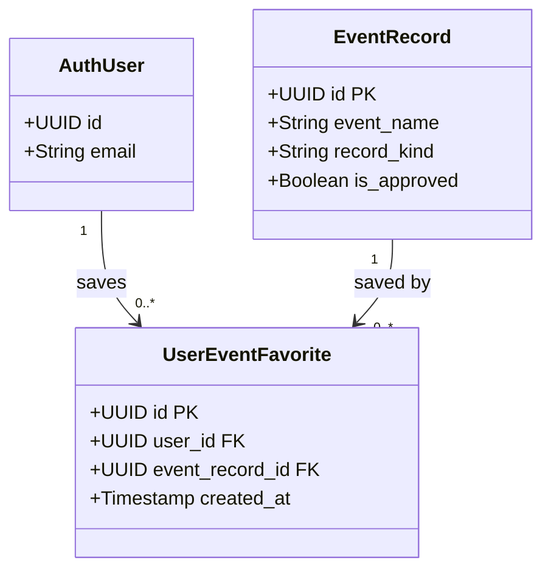

# Class Diagram – Yêu thích sự kiện

Vẽ class diagram cho module lưu sự kiện/địa điểm yêu thích của người dùng.

## Mermaid

## Mô tả

| Bảng | Vai trò |
|---|---|
| `user_event_favorites` | Danh sách sự kiện/địa điểm mà người dùng đánh dấu yêu thích |

### Ràng buộc nghiệp vụ
- Mỗi cặp `(user_id, event_record_id)` là duy nhất — không thể yêu thích cùng một sự kiện hai lần.
- RLS cho phép mọi người dùng đã xác thực xem danh sách yêu thích (public feature).
- Chỉ chủ sở hữu mới có thể thêm hoặc xoá mục yêu thích của mình.
- Khi sự kiện bị xoá, các bản ghi yêu thích liên quan tự động bị xoá theo (ON DELETE CASCADE).
