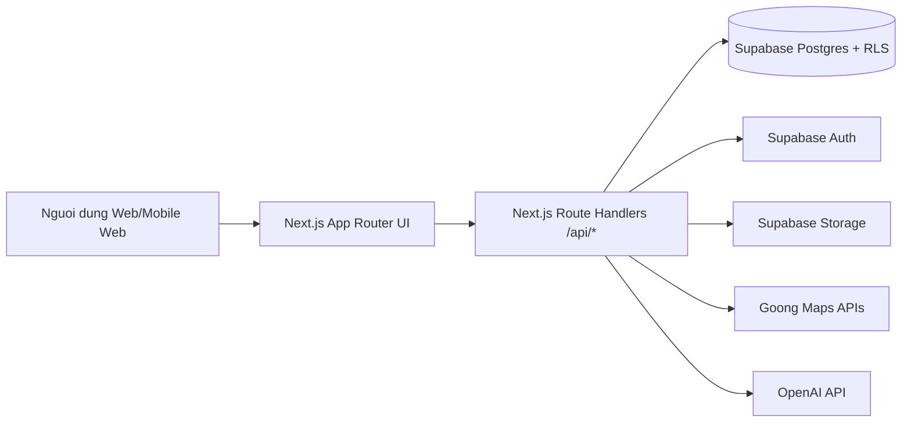
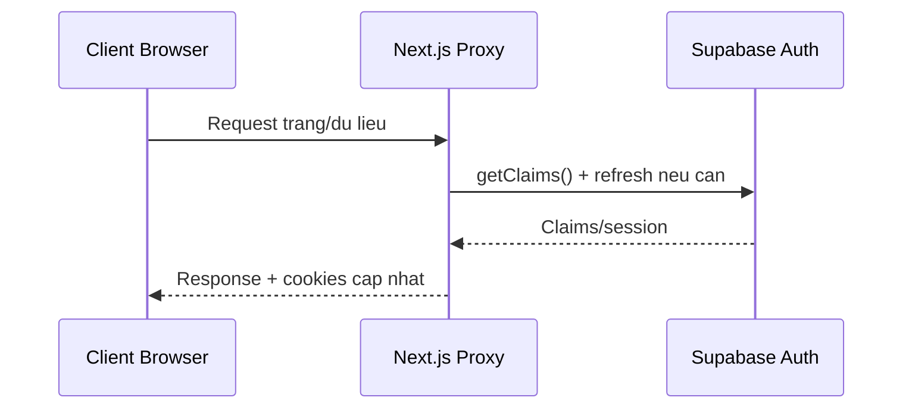

# THIET KE KIEN TRUC HE THONG - VIBE TRIP APP

## 1. Muc tieu tai lieu

Tai lieu nay mo ta kien truc he thong cua Vibe Trip App theo huong:

- Chuan hoa cau truc he thong de phuc vu phat trien va van hanh.
- Lam ro cac thanh phan: giao dien, API, du lieu, tich hop ben thu ba.
- Xac dinh cac luong nghiep vu trong tam va co che bao mat.
- De xuat dinh huong mo rong va toi uu trong cac giai doan tiep theo.

## 2. Pham vi he thong

He thong phuc vu cac nhom chuc nang chinh:

- Quan ly su kien, dia diem theo khu vuc hanh chinh (tinh, xa).
- Ban do tim kiem su kien, bo loc theo vung hien thi, danh muc, ban kinh.
- Lo trinh ca nhan (route planning) va chia se theo quyen rieng tu.
- Dien dan cong dong (bai viet, binh luan, thich) va xa hoi (ket ban).
- He thong thong bao theo su kien nguoi dung.
- Tro ly AI trong man hinh ban do (map AI chat) de goi y theo ngu canh.
- Quan tri phan quyen theo vai tro va pham vi dia ly (RBAC + scope).

## 3. Tong quan kien truc

He thong su dung mo hinh 3 lop mo rong:

- Lop trinh bay: Next.js App Router + React, chia theo cac tab/chuc nang.
- Lop xu ly ung dung: Route Handlers trong Next.js (`src/app/api/**`).
- Lop du lieu va dich vu: Supabase (Auth, Postgres, Storage) + Goong + OpenAI.

### 3.1 So do tong the (context)

### 3.2 Nguyen tac kien truc

- Auth va phien lam viec thong nhat thong qua Supabase SSR client.
- Phan quyen dua tren RLS + ham SQL theo role/scope.
- API route la diem vao duy nhat cho tich hop ben ngoai va logic nghiep vu.
- Du lieu dia ly va ban do toi uu truy van theo viewport + bo loc.
- Kien truc huong module theo domain de de tach, de test va de mo rong.

## 4. Cong nghe va thanh phan

### 4.1 Frontend

- Next.js 16 (App Router), React 19.
- Tailwind CSS 4, Radix UI, shadcn, Recharts.
- MapLibre GL de hien thi ban do va marker.

### 4.2 Backend (BFF trong Next.js)

- Route Handlers trong `src/app/api` dong vai tro Backend for Frontend.
- Xu ly xac thuc nguoi dung qua Supabase server client.
- Validate input va tra ve loi nghiep vu theo HTTP status phu hop.

### 4.3 Data Platform

- Supabase Postgres la CSDL chinh.
- Supabase Auth luu danh tinh, cookie session.
- Supabase Storage luu anh su kien (bucket `events`).
- SQL migrations quan ly schema trong thu muc `databases/`.

### 4.4 Dich vu ben thu ba

- Goong APIs: autocomplete, reverse geocode, place detail, directions.
- OpenAI API: xu ly hoi dap AI theo ngu canh ban do + du lieu noi bo.

## 5. Kien truc logic theo tang

### 5.1 Tang giao dien

- Cau truc route theo nhom: `(tabs)`, auth, policy pages.
- Cac component app trong `src/components/app` theo domain:
  - events composer, forum feed, map panel, notifications, account form.
- Muc tieu: dong nhat trai nghiem va tai su dung UI.

### 5.2 Tang API/BFF

API route tieu bieu:

- `/api/map/event-records`: tai diem su kien theo viewport + category + radius.
- `/api/map/event-categories`: tai danh muc su kien cho bo loc ban do.
- `/api/map/ai-chat`: AI chat theo ngu canh ban do, luu hoi thoai.
- `/api/events/favorites`: them/xoa yeu thich su kien da duyet.
- `/api/routes`: tao/sua lo trinh ca nhan va diem dung.
- `/api/goong/*`: proxy truy cap dich vu Goong.
- `/api/admin/users/by-email`: tra cuu phuc vu quan tri.
- `/api/wards`: truy van du lieu xa theo tinh.

### 5.3 Tang du lieu

Nhom bang trong Postgres:

- Hanh chinh va phan quyen: `provinces`, `wards`, `user_roles`, `province_managers`, `ward_admins`, `access_requests`.
- Su kien va dia diem: `event_records`, `event_categories`, `event_organizers`, `event_record_schedules`, bang lien ket danh muc/to chuc.
- Xa hoi cong dong: `forum_posts`, `forum_post_comments`, `forum_post_likes`, `user_friendships`, `user_notifications`.
- Ban do nang cao: `map_ai_conversations`, `map_ai_messages`.
- Ca nhan hoa: `user_routes`, `user_route_stops`, `user_event_favorites`.

## 6. Luong du lieu nghiep vu chinh

### 6.1 Dang nhap va duy tri phien

### 6.2 Dang su kien va phe duyet theo scope

1. Nguoi dung tao `event_record` va du lieu lien quan.
2. Ban ghi o trang thai cho duyet (`is_approved = false`).
3. Nguoi co quyen review (admin/province_manager/ward_admin) phe duyet hoac tu choi.
4. He thong cap nhat thong tin review va thong bao lien quan.

### 6.3 Tim kiem ban do

1. Client gui viewport (`minLat`, `maxLat`, `minLng`, `maxLng`).
2. API loc theo approved + coordinates + bo loc danh muc/tu khoa/ban kinh.
3. Tra ve danh sach marker toi da 500 ban ghi.
4. Client render marker va thong tin chi tiet.

### 6.4 Tro ly AI tren ban do

1. Client gui prompt + user location + viewport + conversation id (neu co).
2. API nap context tu `event_records`, `user_routes`, `user_route_stops`.
3. Goi OpenAI voi schema output co cau truc (`answer`, `references`).
4. Luu message nguoi dung va message AI vao `map_ai_messages`.
5. Tra ve noi dung tra loi va lien ket doi tuong duoc tham chieu.

### 6.5 Lo trinh ca nhan

1. User tao route voi diem dau va cac diem dung.
2. API ghi `user_routes`, sau do ghi `user_route_stops`.
3. Neu ghi stop that bai, thuc hien cleanup best-effort route vua tao.
4. Ho tro cap nhat route bang co che replace toan bo danh sach stop.

## 7. Bao mat va kiem soat truy cap

### 7.1 Co che xac thuc

- Supabase Auth + cookie-based session.
- SSR client cho server context; browser client cho client context.
- Service role key chi su dung o admin client tren server.

### 7.2 Co che phan quyen

- RBAC theo enum role: `admin`, `province_manager`, `ward_admin`.
- Scope theo dia ly thong qua `province_managers`, `ward_admins`.
- RLS ap tren cac bang nhay cam de rang buoc SELECT/INSERT/UPDATE/DELETE.
- SQL function ho tro: `has_role`, `can_manage_ward`, `can_review_event_record`, ...

### 7.3 Bao mat du lieu va API

- Kiem tra payload va rang buoc input tai API route.
- Tach biet bien moi truong public key va service role key.
- Han che tiet lo thong tin loi he thong, uu tien message nghiep vu.
- Cac du lieu cong khai (su kien da duyet) va du lieu rieng (route private) duoc tach quyen ro rang.

## 8. Hieu nang, kha nang mo rong, do tin cay

### 8.1 Hieu nang

- Truy van ban do theo viewport de giam tap du lieu.
- Gioi han ket qua (`limit`) tren endpoint ban do.
- Loc phia SQL ket hop loc bo sung theo khoang cach Haversine khi can.
- Denormalize mot so cot lich (`organized_at`, `opens_at`, `closes_at`) cho truy van nhanh.

### 8.2 Kha nang mo rong

- Mo rong ngang ung dung web thong qua scale runtime Next.js.
- CSDL mo rong doc/ghi theo nang luc Supabase managed Postgres.
- Kien truc module cho phep tach rieng service AI/Map neu tai tang cao.

### 8.3 Do tin cay

- Supabase cung cap backup/ha tang managed.
- Giao dich ghi nhieu buoc co xu ly rollback/best-effort cleanup tai API.
- Trigger SQL cap nhat timestamp va thong bao tu dong, giam sai lech du lieu.

## 9. Quan sat he thong va van hanh

### 9.1 Logging

- Logging tai API route cho cac loi tich hop (Goong/OpenAI/Supabase).
- Theo doi ma loi HTTP theo endpoint.

### 9.2 Chi so de theo doi

- Latency p50/p95 theo endpoint quan trong (`/api/map/event-records`, `/api/map/ai-chat`, `/api/routes`).
- Ty le loi 4xx/5xx.
- So luong request theo module va gio cao diem.
- Ty le thanh cong phe duyet su kien, ty le luu route thanh cong.

### 9.3 Canh bao

- Canh bao khi ty le loi 5xx vuot nguong.
- Canh bao khi do tre endpoint AI tang cao bat thuong.
- Canh bao khi endpoint map co xu huong timeout.

## 10. Trien khai va moi truong

### 10.1 Bien moi truong toi thieu

- `NEXT_PUBLIC_SUPABASE_URL`
- `NEXT_PUBLIC_SUPABASE_PUBLISHABLE_KEY` hoac `NEXT_PUBLIC_SUPABASE_ANON_KEY`
- `SUPABASE_SERVICE_ROLE_KEY` (chi server-side)
- Bien cau hinh cho Goong API
- `OPENAI_API_KEY`

### 10.2 Pipeline phat trien

1. Phat trien tinh nang tren branch.
2. Cap nhat migration trong `databases/` neu doi schema.
3. Kiem tra chat luong bang TypeScript + ESLint.
4. Build va trien khai moi truong staging/production.

## 11. Rui ro kien truc va giai phap

1. Rui ro: Endpoint AI co do tre cao va chi phi bien dong.
	Giai phap: gioi han context, cache ket qua theo conversation, gioi han tan suat.
2. Rui ro: Truy van ban do khi viewport lon co the qua tai.
	Giai phap: gioi han zoom toi thieu de tai marker, phan trang theo o luoi (tile-based query).
3. Rui ro: Logic quyen phuc tap theo role + dia ly.
	Giai phap: tap trung logic trong SQL function va bo test RLS bat buoc.
4. Rui ro: Ghi du lieu nhieu bang de gay bat nhat.
	Giai phap: uu tien transaction RPC hoac stored procedure cho cac use case ghi nhieu buoc.

## 12. Dinh huong mo rong de xuat

1. Bo sung test tu dong cho API route quan trong va policy RLS.
2. Xay dung geospatial indexing/chuyen sang truy van khong gian native khi kho du lieu tang.
3. Them co che queue cho tac vu thong bao va su kien bat dong bo.
4. Tich hop observability day du (tracing + dashboard + alert playbook).
5. Tach rieng AI orchestration service neu nhu cau va traffic tang manh.

## 13. Ket luan

Kien truc hien tai phu hop mo hinh san pham web hien dai voi BFF tren Next.js va data platform Supabase, dam bao can bang giua toc do phat trien va kiem soat bao mat du lieu. Voi viec tiep tuc chuan hoa test RLS, toi uu truy van ban do va nang cap observability, he thong co nen tang tot de mo rong o quy mo nguoi dung lon hon.
